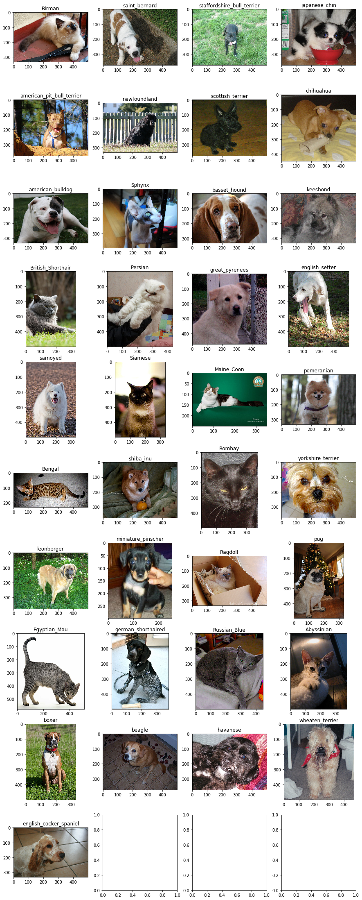

# Deep Learning Course

## Постановка задачи

Цель настоящей работы состоит в том, чтобы получить базовые навыки работы с 
библиотекой глубокого обучения Keras на примере
полностью связанных нейронных сетей.

В рамках данной лабораторной работы будет решаться задача классификации пород кошечек/собачек.

Используемые данные [The Oxford-IIIT Pet Dataset](https://www.kaggle.com/tanlikesmath/the-oxfordiiit-pet-dataset)

Обучающая выборка содержит 37 классов с различными породами кошечек и собачек. На каждый класс имеется около 200 изображений. На изображениях животные могут быть изображены в различных положениях, при разных условиях света.

## Описание данных

|Category|Elements count|
|------------------------------|-------|
| 	Birman                     |200    |
| 	saint_bernard			   |200    |                     
| 	staffordshire_bull_terrier |191    |                     
| 	japanese_chin              |200    |
| 	american_pit_bull_terrier  |200    |
| 	newfoundland               |200    |
| 	scottish_terrier           |199    |
| 	chihuahua                  |200    |
| 	american_bulldog           |200    |
| 	Sphynx                     |200    |
| 	basset_hound               |200    |
| 	keeshond                   |200    |
| 	British_Shorthair          |200    |
| 	Persian                    |200    |
| 	great_pyrenees             |200    |
| 	english_setter             |200    |
| 	samoyed                    |200    |
| 	Siamese                    |200    |
| 	Maine_Coon                 |200    |
| 	pomeranian                 |200    |
| 	Bengal                     |200    |
| 	shiba_inu                  |200    |
| 	Bombay                     |200    |
| 	yorkshire_terrier          |200    |
| 	leonberger                 |200    |
| 	miniature_pinscher         |200    |
| 	pug                        |200    |
| 	Ragdoll                    |200    |
| 	Egyptian_Mau               |200    |
| 	german_shorthaired         |200    |
| 	Russian_Blue               |200    |
| 	Abyssinian                 |200    |
| 	boxer                      |200    |
| 	beagle                     |200    |
| 	havanese                   |200    |
| 	wheaten_terrier            |200    |
| 	english_cocker_spaniel	   |200    |

## Примеры изображений:

## Анализ данных:

Изображения являются разношерстными по слeдующим характеристикам:

- Каждое изображение имеет разный размер.

Показатель | Значение |
------------ | ------------
average height | 390.9136671177267
average weight | 436.7451962110961
minSize 	   | 137x103
maxSize 	   | 3264x2448

-  Информативность изображения (наличие посторонних предметов, возраст животных, изображения необязательно имеют квадратную форму, животное не обязательно находится в центре изображения)

Примеры принадлежащие к классу Рэгдолл.

## Метрики качества

В качестве метрики качества используем accuracy.

## Исходный формат хранения данных

Обучающая выборка состоит из изображений в формате RGB, название файлов содержит название породы животного.
Все изображения лежат в одной папке. Данные никак не группированы.

## Подготовка входных данных

Подготовка включает в себя заполнение csv файла с данными о названии класса и пути к изображению для каждого обучающего элемента.

#### Образец заполнения файла

Category | Path
------------- | -------------
pug | ./images/pug_114.jpg
pug | ./images/pug_100.jpg
pug | ./images/pug_101.jpg
pug | ./images/pug_115.jpg
pug | ./images/pug_93.jpg
pug | ./images/pug_87.jpg
Birman | ./images/Birman_175.jpg
Birman | ./images/Birman_161.jpg
Birman | ./images/Birman_4.jpg
Birman | ./images/Birman_67.jpg
Birman | ./images/Birman_73.jpg

Приведем изображения к одному размеру ***(224x224)***. Изображения с меньшим размером использовать не будем, а с большим размером уменьшим с помощью метода ***bicubic interpolation***. Было отброшено ***3,9%*** изображений.

#### Разделение данных

Датасет был разделен на три части. Элементы классов были равномерно распределены по частям, в следующих пропорциях.

Часть | Процент изображений
:-------------:|:-------------:
Тренировочная | 90%
Валидационная | 5%
Тестовая      | 5%

Так как загрузка всех изображений выборки является затратной по памяти операцией,
для передачи входных данных в модели использовались генераторы, которые случайным образом достают
batch изображений. Размер используемого ***batch_size=32***

