# Convolutional

## [Введение](../README.md)

Вся проведенная работа содержится в Jupiter-ноутбуке [main.ipynb](main.ipynb). Файл включает в себя:

* Подготовку тестовых, тренировочных, валидационных данных
* Создание моделей
* Обучение моделей
* Визуализацию каждого шага
* Тестирование модели с использованием тестовых данных

## Теория

В наших моделях было использовано:

- Функция активации Relu на скрытых слоях: 

- Функция активации SoftMax на выходном слое: 

- Слой BatchNormalization. Этот слой нормализует данные по батчу: сводит математическое ожидание к 0 и дисперсию к 1 ([arxiv](https://arxiv.org/abs/1502.03167))

- Слой Dropout, который случайным образом отключает часть нейронов. Это позволяет предотвратить переобучение, путем тренировки некого ансамбля сетей ([arxiv](https://arxiv.org/abs/1207.0580))

- GlobalAveragePooling2D, который берет среднее по всем каналам. Это позволяет сильно уменьшить количество обучаемых параметров на классификационном Dense слое, что в свою очередь помогает бороться с переобучением

- Оптимизатор Adam - adaptive momentum ([arxiv](https://arxiv.org/abs/1412.6980v9)).  ***Learning rate=1e-2*** , установлен по умолчанию в выбранной библиотеке

- Инициализация начальных весов с помощью Xavier uniform initializer, установлен по умолчанию в выбранной библиотеке

## Конфигурации моделей

В данной работе были проведены эксперементы со следующими моделями

1. ***Сверточная модель с тремя скрытыми слоями***

[//]: # 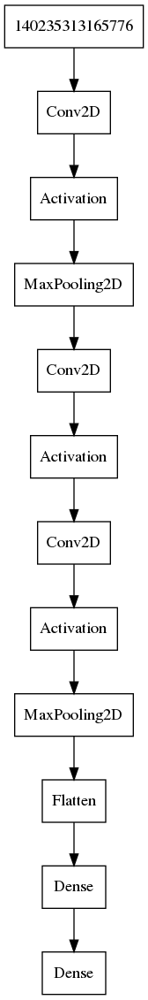

| Layer (type) | Output Shape   | Param #   |
|--------------|----------------|-----------|
| Conv2D       | (112, 112, 64) | 9472      |
| Relu         | (112, 112, 64) | 0         |
| MaxPooling2D | (56, 56, 64)   | 0         |
| Conv2D       | (56, 56, 128)  | 73856     |
| Relu         | (56, 56, 128)  | 0         |
| Conv2D       | (56, 56, 128)  | 147584    |
| Relu         | (56, 56, 128)  | 0         |
| MaxPooling2D | (28, 28, 128)  | 0         |
| Flatten      | (100352)       | 0         |
| Dense        | (256)          | 25690368  |
| Dense        | (37)           | 9509      |

Total params: 25,930,789

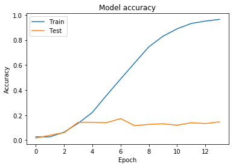

2. ***Сверточная модель с использованием Batch Normalization + Global Pooling***

[//]: # 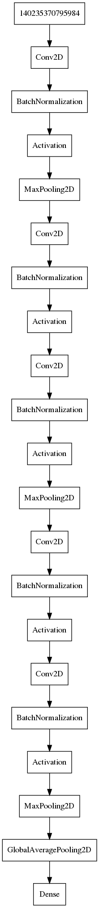

| Layer (type)           |Output Shape    | Param #   |
|------------------------|----------------|-----------| 
| Conv2D                 | (112, 112, 64) | 9472      |
| batch_normalization    | (112, 112, 64) | 256       |
| Relu                   | (112, 112, 64) | 0         |
| max_pooling            | (56, 56, 64)   | 0         |
| Conv2D                 | (56, 56, 128)  | 73856     |
| batch_normalization    | (56, 56, 128)  | 512       |
| Relu                   | (56, 56, 128)  | 0         |
| Conv2D                 | (56, 56, 128)  | 147584    |
| batch_normalization    | (56, 56, 128)  | 512       |
| Relu                   | (56, 56, 128)  | 0         |
| max_pooling            | (28, 28, 128)  | 0         |
| Conv2D                 | (28, 28, 256)  | 295168    |
| batch_normalization    | (28, 28, 256)  | 1024      |
| Relu                   | (28, 28, 256)  | 0         |
| Conv2D                 | (28, 28, 256)  | 590080    |
| batch_normalization    | (28, 28, 256)  | 1024      |
| Relu                   | (28, 28, 256)  | 0         |
| max_pooling            | (14, 14, 256)  | 0         |
| global_average_pooling | (256)          | 0         |
| Dense                  | (37)           | 9509      |

Total params: 1,128,997

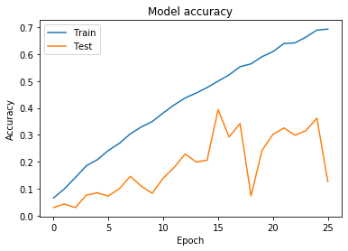

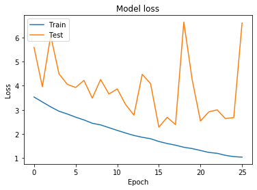

Переобучение снизилось. Точность на тренировочной выборке возросла до 0,68. Сходится модель намного быстрее благодаря слоям батч нормализации. Попробуем добавить дропаут перед слоем классификации, чтобы еще снизить переобучение.

3. ***Сверточная модель с использованием Batch Normalization + Global Pooling + Dropout***

[//]: # 

| Layer (type)           | Output Shape   | Param #   |
|------------------------|----------------|-----------| 
| Conv2D                 | (112, 112, 64) | 9472      |
| batch_normalization    | (112, 112, 64) | 256       |
| Relu                   | (112, 112, 64) | 0         |
| max_pooling            | (56, 56, 64)   | 0         |
| Conv2D                 | (56, 56, 128)  | 73856     |
| batch_normalization    | (56, 56, 128)  | 512       |
| Relu                   | (56, 56, 128)  | 0         |
| Conv2D                 | (56, 56, 128)  | 147584    |
| batch_normalization    | (56, 56, 128)  | 512       |
| Relu                   | (56, 56, 128)  | 0         |
| max_pooling            | (28, 28, 128)  | 0         |
| Conv2D                 | (28, 28, 256)  | 295168    |
| batch_normalization    | (28, 28, 256)  | 1024      |
| Relu                   | (28, 28, 256)  | 0         |
| Conv2D                 | (28, 28, 256)  | 590080    |
| batch_normalization    | (28, 28, 256)  | 1024      |
| Relu                   | (28, 28, 256)  | 0         |
| max_pooling            | (14, 14, 256)  | 0         |
| global_average_pooling | (256)          | 0         |
| dropout                | (256)          | 0         |
| Dense                  | (37)           | 9509      |

Total params: 1,128,997

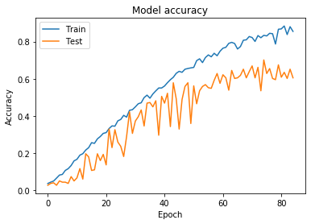

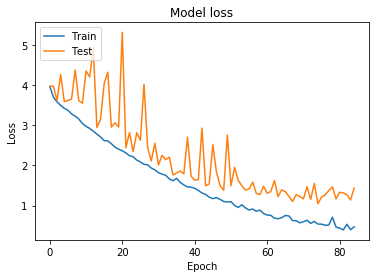

Большой процент дропаута сильно помог с переубучением! Сохраним на состояние модели для последующих тестов.

#### Попробуем применить аугментацию наших изображений
- случайный поворот на 10 градусов
- случайное зуммирование на 10%
- случайное изменение яркости в диапозоне [0.7, 1.3]
- случайное горизонтальное отображение

Это должно привести к более стабильным результатам. Используем предыдущую архитектуру сети, т.к. она дала самые лучшие результаты.

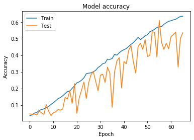

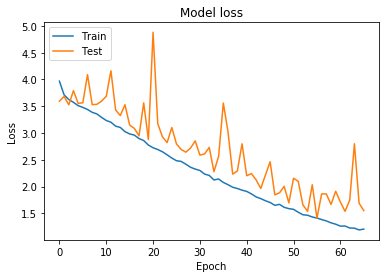

Как видно из графика сильно это не помогло. Предположение: уменьшить learning rate, возможно модель зависла на плато и сойдется еще чуть-чуть. Используем lr=0.0003, как советовал ***Andrej Karpathy*** в своем [твиттере](https://twitter.com/karpathy/status/801621764144971776) =D

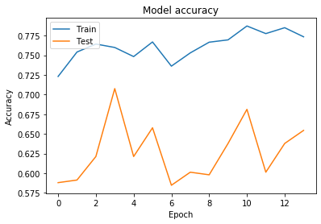

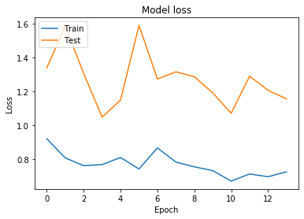

***+12% точности*** на валидационной выборке! Неплохо. Остановимся на этом и сохраним модель.

## Тестирование моделей

Для тестирования использовались следующие модели:

- С использованием аугментации данных

| loss   | accuracy |
|:------:|:--------:|
| 1.0759 | 0.6678   |

- Без использования аугментации данных

| loss   | accuracy |
|:------:|:--------:|
| 1.4011 | 0.6031   |

### Пример

Запустим обе модели и попробуем определить породу для данного изображения 

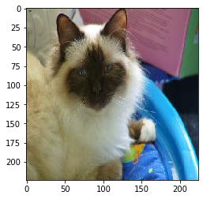

Expected category : Birman

| Category | without data aug | with data aug |
|:--------:|:----------------:|:-------------:|
|Birman    | 0.2598           | 0.6058        |
|Siamese   | 0.7225           | 0.3518        |
|Ragdoll   | 0.0143           | 0.0421        |
