## [Введение](../README.md)

Вся проведенная работа содержится в Jupiter-ноутбуке [main.ipynb](./main.ipynb).
Файл включает в себя:
* Подготовку тестовых, тренировочных, валидационных данных.
* Создание моделей
* Обучение моделей
* Визуализацию каждого шага
* Тестирование модели с использованием тестовых данных

В процессе лабораторной работы было выполнено множество различных комбинаций предобработки изображений. Ниже приведена таблица используемых параметров класса ImageDataGenerator.

| Параметр        | 1     | 2     | 3     | 4     | 5     | 6     |
|-----------------|-------|-------|-------|-------|-------|-------|
| rescale         | 1/255 | 1/255 | 1/255 | 1/255 | 1/255 | 1/255 |
| rotation range  | 2     | 1     | 4     | 0.5   | 2     | 1     |
| width shift     | 1     | 2     | 5     | 0.3   | 0.1   | -     |
| heigth shift    | -     | 1     | 3     | 2     | 1     | 1     |
| zoom range      | 2     | 0.05  | 0.1   | 0.5   | 0.7   | 0.5   |
| horizontal flip | -     | -     | true  | true  | true  | -     |
| vertical flip   | true  | -     | -     | -     | -     | true  |

Для остановки обучения в случаях не уменьшения валидационной ошибки мы использовали EarlyStoping c patience=4.

## Выбор библиотеки
Для выполнения лабораторных работ была выбрана библиотека Keras для языка программирования Python.

На этапе проверки корректности установки библиотеки выполнена разработка и запуск тестового примера сети для решения задачи классификации рукописных цифр набора данных MNIST. Достигнута точность 0.89.
## Тренировочные и тестовые наборы данных
В качестве тренировочной выборки используем 5345 изображений различных животных.
В качестве тестовой выборки используем 629 изображений животных.
## Теория
В наших моделях было использовано:
- 
- 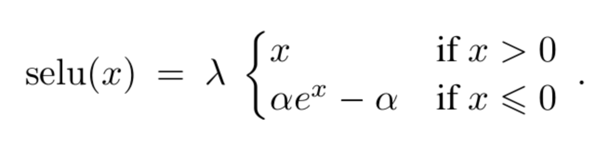
- 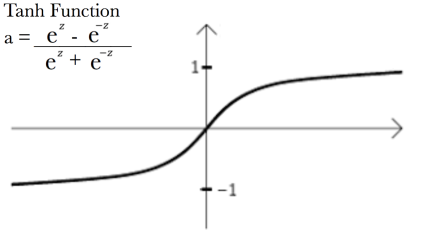
- Оптимизатор Adam - adaptive momentum ([arxiv](https://arxiv.org/abs/1412.6980v9)).  ***Learning rate=1e-2*** , установлен по умолчанию в выбранной библиотеке
- Функция активации SoftMax на выходном слое: 
 - Функция ошибки ***categorical cross-entropy*** для классификации на несколько классов:
 
- Инициализация начальных весов с помощью Xavier uniform initializer, установлен по умолчанию в выбранной библиотеке

Для обучения был использован модифицированный метод градиентного спуска. Adam — adaptive moment estimation, оптимизационный алгоритм. Он сочетает в себе и идею накопления движения и идею более слабого обновления весов для типичных признаков. Его реализация имеется в библиотеке Keras. Для начальной инициализации весов был использован Xavier Initialization
# Конфигурации
## Однослойные
### ReLu
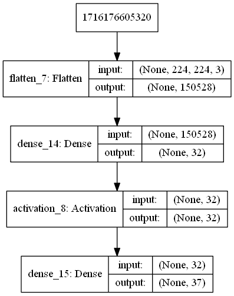
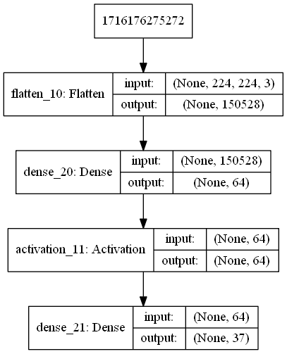

### SeLu
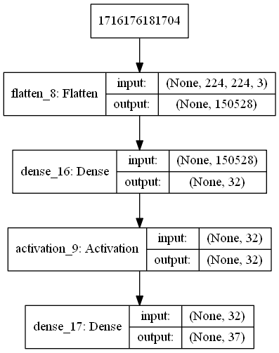
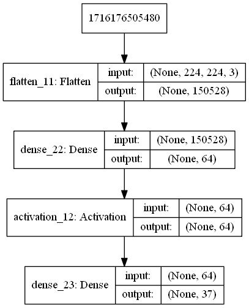
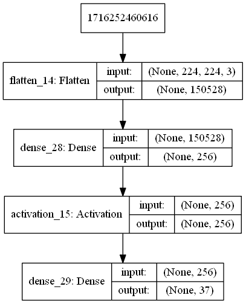
### Tanh

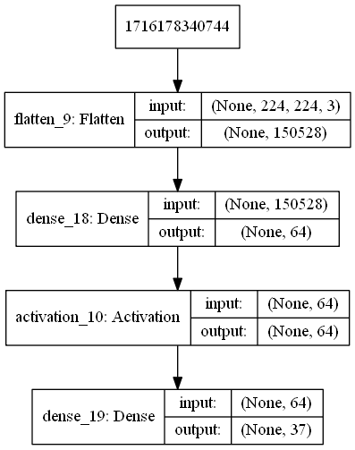

## Двухслойные
### ReLu

### SeLu

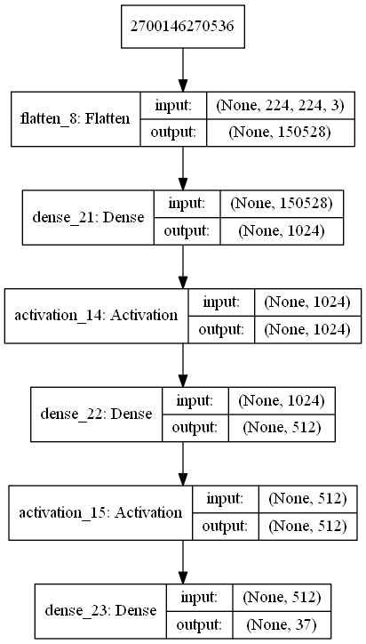
### Tanh
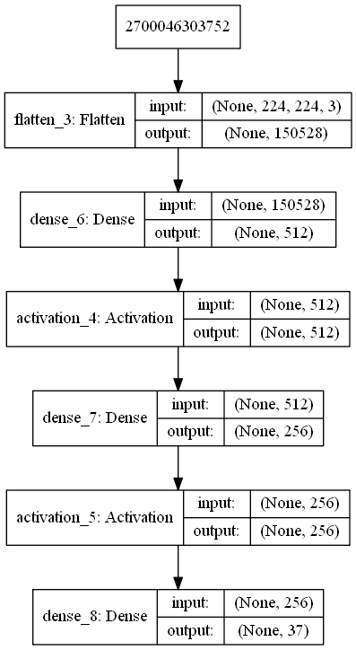

Несмотря на множество вариаций препроцессинга данных и конфигураций полносвязных нейронный сетей, результаты оказались плачевными при сжатии картинок до размера 224х224, когда возможно детектирование классов "человеческим" способом, то есть глазами. Представлены суммаризирующие графики всех конфигураций (без легенды подсветок), чтобы подтвердить низкий уровень предсказаний на **любой ** из обученных версий (~4% accuracy для однослойных вариантов, ~5% accuracy для двуслойных вариантов):

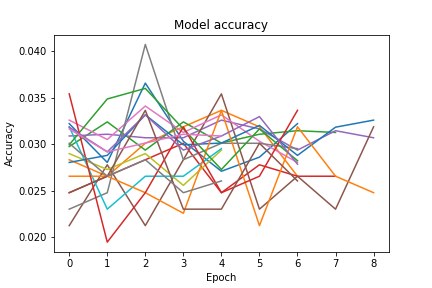
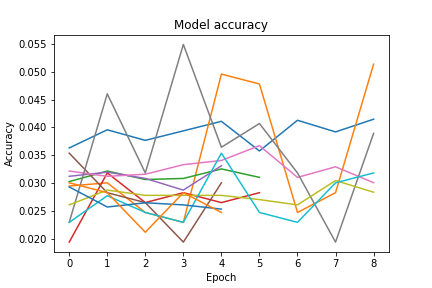

Также предоставлены аналогичные графики для метрики loss:

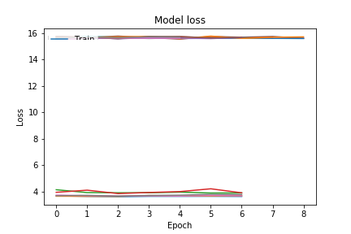
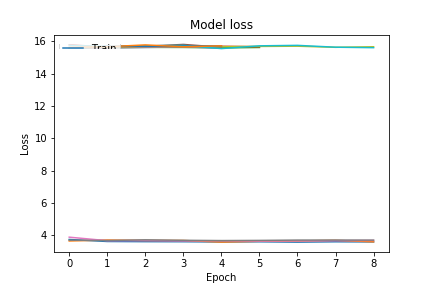

Лучшей детектирующей способностью обладали нейронные сети, работающие на более сжатых изображениях, размера 32х32.
Были произведены эксперименты с вариацией количества нейронов на скрытом слое однослойной полносвязной сети и с изменением функций активации:
| # | Neurons | Activation | Train Accuracy | Test accuracy |
|---|---------|------------|----------------|---------------|
| 1 | 256     | `tahn`     |         0.1017 |        0.1111 |
| 2 | 256     | `relu`     | 0.1287         | 0.1236        |
| 3 | 256     | `selu`     | 0.0889         | 0.1017        |
| 4 | 1024    | `tahn`     | 0.0794         | 0.1064        |
| 5 | 1024    | `relu`     | 0.1247         | **0.1283**    |
| 6 | 1024    | `selu`     | 0.0275         | 0.0297        |

Из таблицы видно, что лучшая конфигурация достигает 12% предсказания с использованием ReLU на скрытом слое из 1024 нейронов.

Расширение конфигурации до двухслойных нейронных сетей не показывает изменения в показателях.

## Разработанные программы/скрипты
Был разработан python-скрипт create_csv.py, обрабатывающий массив изображений и создающий csv-файл с двумя столбцами: category и path. Первый столбец содержит информацию вида class_name, второй столбец содержит относительный путь до изображения. Затем был разработан .ipynb-скрипт реализующий обучение нейронной сети. Для генерации тренировочных и валидационных данных был использован упомянутый выше csv-файл. Для предобработки изображений из нашей тренировочной выборки использовался класс ImageDataGenerator, определяющий конфигурацию подготовки данных. В процессе обучения нейронной сети были испробованы следующие параметры класса: rescale, rotation range, horizontal and vertical flip, width and height shift. В свою очередь предобработка валидационных данных заключалась в применении rescale. Далее проходит обучение двух наших моделей с применением различных функций активации, таких как: гиперболический тангенс, ReLu и SeLu. Первая модель является однослойной, вторая - двухслойной.
## Выводы
При переборе вариантов препроцессинга данных, количества слоев сети, количества нейронов соответствующих слоев сети, функций активаций для полносвязных нейронных сетей не удалось получить уровень предсказаний выше 12%.
Столь низкий показатель точности обусловлен слишком «разными» изображениями в изучаемом датасете. Ниже приведены несколько изображений, сгруппированных по своим классам. Необходимо обратить внимание, что картинки, относящиеся к одному и тому же классу имеют низкий уровень сходства между собой, чтобы полносвязная нейронная сеть могла быть обучена для их детектирования. По нашим статистическим данным, почти все классы датасета имеют более 10% подобных "выбивающихся", с точки зрения полносвязных сетей, картинок.

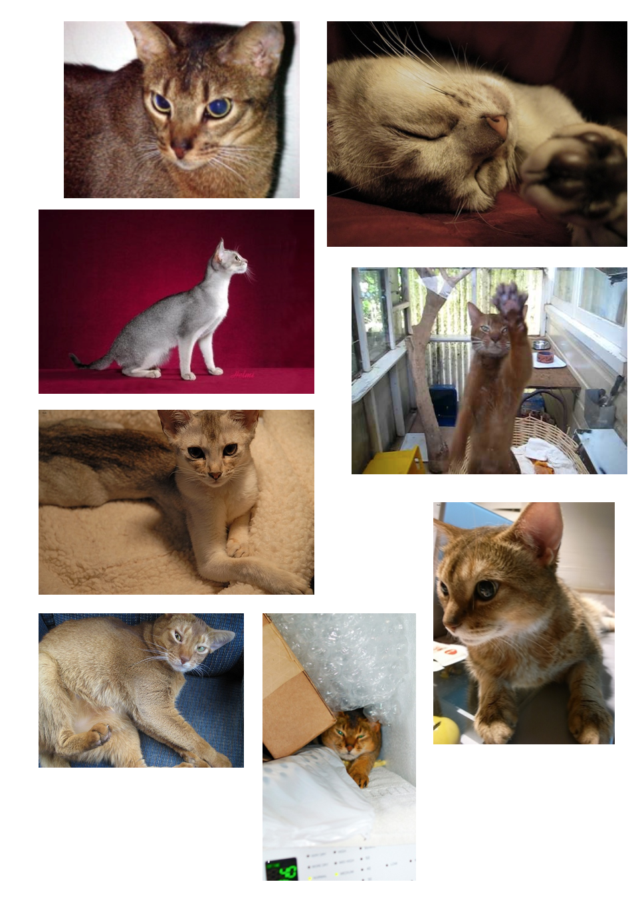
++++
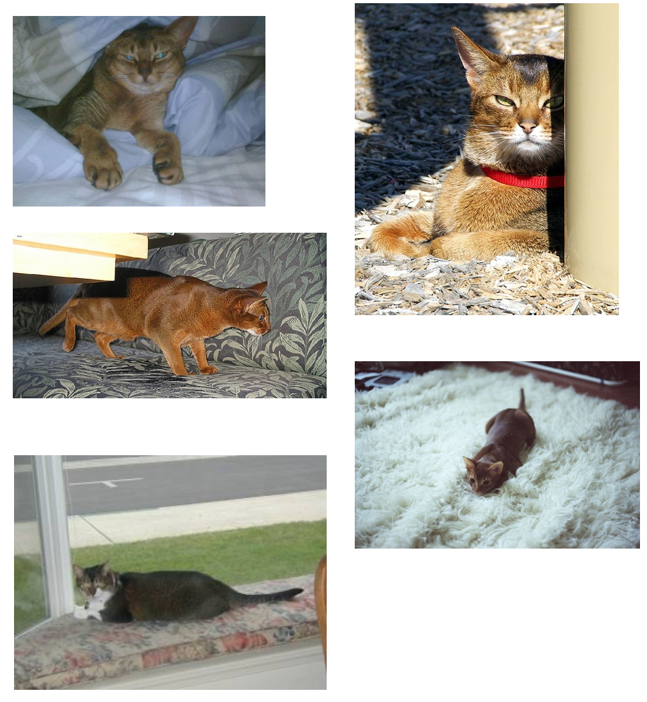
