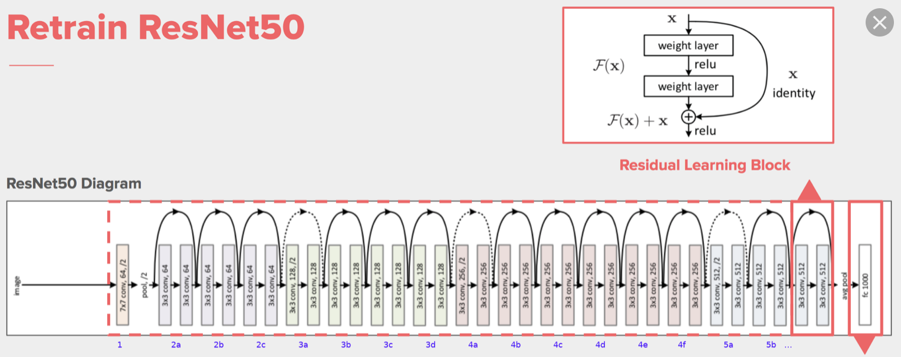
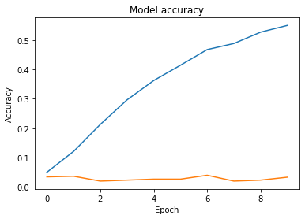
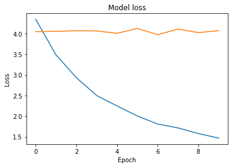
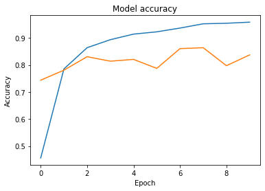
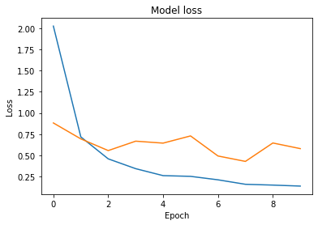
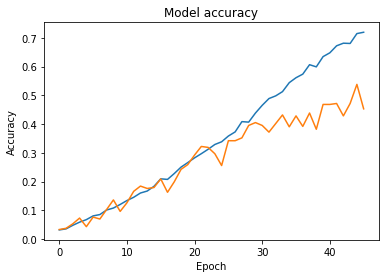
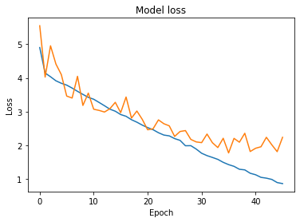
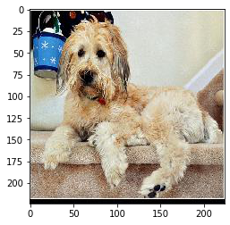

# Transfer-learning

## [Введение](../README.md)

Вся проведенная работа содержится в Jupyter-ноутбуке [main.ipynb](main.ipynb). Файл включает в себя:

* Подготовку тестовых, тренировочных, валидационных данных
* Создание моделей
* Обучение моделей
* Визуализацию каждого шага
* Тестирование модели с использованием тестовых данных

## Теория

В наших моделях было использовано:

- Мы испольвали сеть ResNet-50 ([arxiv](https://arxiv.org/abs/1512.03385)), предобученную на датасете [ImageNet](http://www.image-net.org/), который содержит в себе 1000 классов.

Для использования разных типов переноса обучения последний слой ***Dense*** был заменен на классификатор для наших данных. Который включает в себя:

- Слой ***GlobalAveragePooling2D***, который берет среднее по всем каналам. Это позволяет сильно уменьшить количество обучаемых параметров на классификационном Dense слое, что в свою очередь помогает бороться с переобучением

- Слой ***Dropout***, который случайным образом отключает часть нейронов. Это позволяет предотвратить переобучение, путем тренировки некого ансамбля сетей ([arxiv](https://arxiv.org/abs/1207.0580))

- Функция активации ***SoftMax*** на выходном полносвязном слое: 

- Оптимизатор ***Adam*** - adaptive momentum ([arxiv](https://arxiv.org/abs/1412.6980v9)).  ***Learning rate=3e-4***

     

     

 - Функция ошибки ***Categorical Cross-Entropy*** для классификации на несколько классов:

 

#### Аугментация для изображений

В данной работе была применена аугметация данных для предотвращения переобучения и стабильности модели к небольшим изменениям изображений.

- случайный поворот на 10 градусов
- случайное зуммирование на 10%
- случайное изменение яркости в диапозоне [0.7, 1.3]
- случайное горизонтальное отображение

## Перенос обучения

В рамках данной лабораторной работы были проведены эксперементы с следующими типами переноса обучения:

1. Перенос признакового представления (*feature representation transfer*). Цель данного типа переноса состоит в том, чтобы обучить «хорошее» представление признаков целевого домена. При этом знания, используемые для передачи между доменам, кодируются в представлении обучаемой функции.

Идея данного подхода состоит в том, чтобы удалить из глубокой модели классификатор (последние полностью связанные слои) и рассматривать начальную часть сети
как метод выделения признаков. При этом взамен старого классификатора можно поместить новый классификатор (например, другой набор полностью связанных слоев или машину
опорных векторов) и обучить его на признаках, построенных с использованием начальной части сети.

2. Перенос обучения на основе экземпляров (*instance-based transfer learning*) предполагает, что используются некоторые части тренировочного множества из исходного домена в ходе обучения целевой задачи.

Этот подход предполагает, что последние слои глубокой модели, соответствующие классификатору, который решает исходную *Задачу А* (в нашем случае ImageNet), заменяются новым классификатором (например, набором полностью связанных слоев с другим количеством выходов), и полученная модель обучается как единая система.

3. Перенос обучения для родственных доменов (*transfer learning for relational domains*) предполагает, что некоторые отношения между данными в исходном и целевом доменах
подобны. В этом случае передаваемые знания – отношения между данными.

При реализации такой схемы предполагается, что модель, построенная для решения исходной задачи (ImageNet), обучается на данных, подготовленных для решения целевой задачи. При этом веса модели инициализируются случайным образом.

### Перенос признакового представления

Берем предобученную сеть ResNet-50, заменяем последние слои для классификации на свои для последующего обучения. Всем слоям из ResNet ставим флаг trainable=False.

Конфигурация модели (*None* означает инвариантность к размеру входного изображения):

|  Layer (type)            |Output Shape        | Param #    |
|--------------------------|--------------------|------------|
| base_model_output        | (None, None, 2048) | 23,587,712 |
| global_average_pooling2d | (2048)             | 0          |
| dropout                  | (2048)             | 0          |
| dense                    | (37)               | 75813      |

| Total params | Trainable params | Non-trainable params |
|:------------:|:----------------:|:--------------------:|
| 23,663,525   | 75,813           | 23,587,712           |

Как можно увидеть из графиков, сильное переобучение. Можно преположить, что плохие результаты связаны с тем, что веса данной сети заточены под множество других классов, которые плохо коррелируют с нашими. Было бы неплохо дообучить веса для нашей задачи.

### Перенос обучения на основе экземпляров

Берем предобученную сеть ResNet-50, заменяем последние слои для классификации на свои. Всем слоям из ResNet ставим флаг trainable=True, для их дообучения под нашу задачу.

Конфигурация модели (*None* означает инвариантность к размеру входного изображения):

|  Layer (type)            |Output Shape        | Param #    |
|--------------------------|--------------------|------------|
| base_model_output        | (None, None, 2048) | 23,587,712 |
| global_average_pooling2d | (2048)             | 0          |
| dropout                  | (2048)             | 0          |
| dense                    | (37)               | 75813      |

| Total params | Trainable params | Non-trainable params |
|:------------:|:----------------:|:--------------------:|
| 23,663,525   | 23,610,405       | 53,120               |

Результаты получились сильно лучше. Это связано с тем, что в датасете *ImageNet* присутствуют классы животных похожих на наших. К примеру:

- toy terrier
- pug
- Siamese cat

Дообучение весов приводит к тому, что модель начинает понимать особенности (фичи) объектов на изображении на основе общего набора фич из датасета ImageNet. 

### Перенос обучения для родственных доменов

Берем необученную сеть ResNet-50, заменяем последние слои для классификации на свои. Пытаемся обучить полученную архитектуру с нуля.

- Инициализация начальных значений весов с помощью Xavier uniform initializer, установлена по умолчанию в выбранной библиотеке

Конфигурация модели (*None* означает инвариантность к размеру входного изображения):

|  Layer (type)            |Output Shape        | Param #    |
|--------------------------|--------------------|------------|
| base_model_output        | (None, None, 2048) | 23,587,712 |
| global_average_pooling2d | (2048)             | 0          |
| dropout                  | (2048)             | 0          |
| dense                    | (37)               | 75813      |

| Total params | Trainable params | Non-trainable params |
|:------------:|:----------------:|:--------------------:|
| 23,663,525   | 23,610,405       | 53,120               |

Наблюдается переобучение, в связи с разношерстностью данных, о которой упоминалось в предыдущих работах. Модели явно не хватает общего понимания того, что происходит на изображении.

## Тестирование

Наилучшие результаты были получены для второго типа переноса обучения.

| loss   | accuracy |
|:------:|:--------:|
| 0.6234709247946739 | 0.825   |

### Пример

Запустим модель и попробуем определить породу для данного изображения 

Expected category : wheaten_terrier

| Category | without data aug |
|:--------:|:----------------:|
|wheaten_terrier    | 0.98815745 |
|havanese   |0.0051027923        |
|scottish_terrier   | 0.0036167  |
